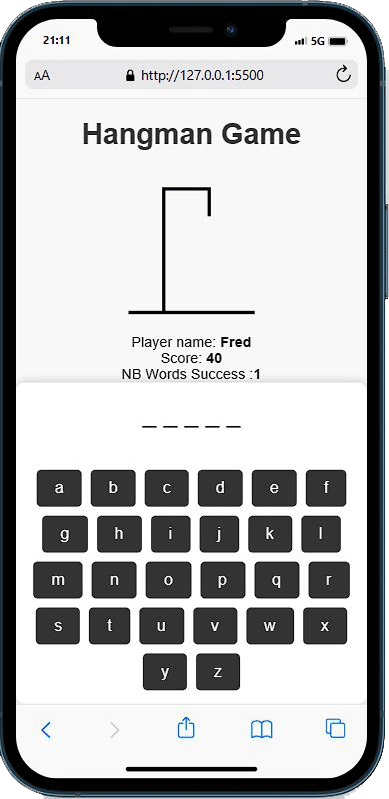
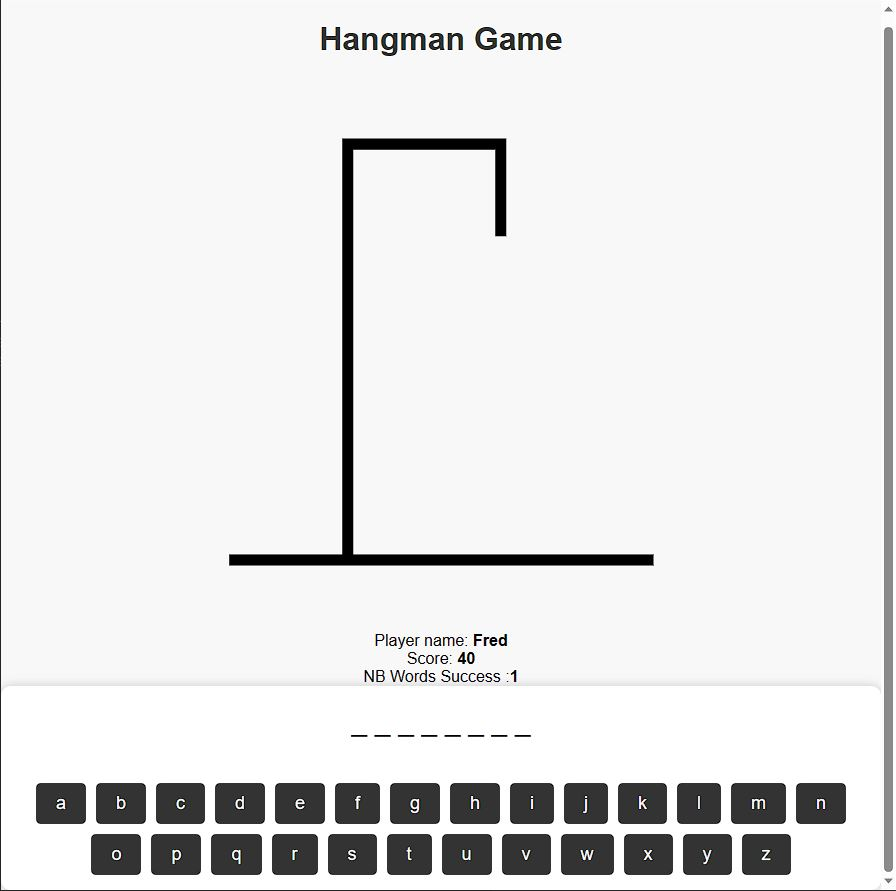


# Hangman
## project made in vanilla javascript
<a href="https://frbot25.github.io/Hangman/">https://frbot25.github.io/Hangman/</a>

 
version mobile

 

### number of files
* index.html
* styles.css
* script.js
  

I created the hangman game entirely in vanilla javascript, the game has themes and three levels of difficulty.

Score management is present, so do not hesitate to try it!
  
Good luck!
